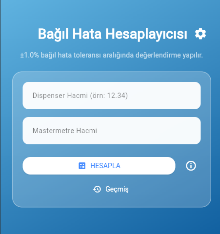

# Bağıl Hata Hesaplayıcısı

Bu proje, dispenser ve mastermetre ölçümlerinden hareketle bağıl hata yüzdesini hesaplayan basit bir Flutter uygulamasıdır.

**Özellikler**
- Dispenser ve mastermetre değerlerinden bağıl hata hesaplama
- Sonuçların uygun/uygunsuz şeklinde işaretlenmesi (±tolerans aralığı)
- Geçmiş kayıtların Hive ile yerel depolanması
- Koyu/aydın tema desteği (kullanıcı ayarları)
- Sonuçları kopyalama ve paylaşma
- Android APK üretimi ve GitHub Actions CI workflow

**Hızlı Başlangıç**

Gereksinimler:
- Flutter 3.x veya daha yenisi
- Android SDK (Android için build yapmak istiyorsanız)
- `flutter` komutu PATH içinde

Kurulum ve çalıştırma:
1. Depoyu klonlayın:

```bash
git clone https://github.com/mrgungor2901/bagil_hata.git
cd bagil_hata
```

2. Bağımlılıkları yükleyin:

```bash
flutter pub get
```

3. Uygulamayı debug modda çalıştırın:

```bash
flutter run
```

4. Analiz ve testler:

```bash
flutter analyze
flutter test
```

5. Android için release APK oluşturma (CI veya yerelde):

```bash
flutter build apk --release
# Çıktı: build/app/outputs/flutter-apk/app-release.apk
```

**Proje Yapısı**
- `lib/main.dart` — Uygulamanın ana kaynağı ve tüm UI/iş mantığı burada bulunur.
- `RELEASES/v1.0.0.md` — Sürüm notları (v1.0.0)
- `.github/workflows/flutter_ci.yml` — GitHub Actions CI workflow (analyze, test, build)

Kaynak referansları:
- Ana dosya: [lib/main.dart](lib/main.dart)
- Sürüm notları: [RELEASES/v1.0.0.md](RELEASES/v1.0.0.md)

**Ayarlar & Veri Depolama**
- Uygulama, kullanıcı ayarlarını (tolerans değeri, koyu tema) ve geçmiş hesaplama kayıtlarını Hive ile yerel olarak saklar.
- Hive adaptörleri `HesaplamaKaydiAdapter` ve `AyarlarAdapter` `lib/main.dart` içinde bulunur.

**Tema ve Renk Uyumluluğu**
- Flutter sürümlerindeki deprecations (ör. `withOpacity`, `ColorScheme.background`) için uyumluluk iyileştirmeleri yapıldı. Proje Material3 kullanır ve `darkTheme`/`theme` ayrımı ile tema modları yönetilir.

**CI / CD**
- `.github/workflows/flutter_ci.yml` eklendi; `main` dalına her push veya PR'da `flutter analyze`, `flutter test` ve `flutter build apk --release` çalıştırır.

**Sürüm Notları (v1.0.0)**
- Kısa: İlk resmi sürüm — küçük iyileştirmeler, stil ve deprecation düzeltmeleri.
- Ayrıntılar: `RELEASES/v1.0.0.md` dosyasına bakınız.

**Yayın (Release) Oluşturma (Özet)**
- GitHub web UI veya `gh` CLI ile `v1.0.0` tag'ine bağlı bir release oluşturabilirsiniz.
- Alternatif: GitHub REST API ile otomatik release yaratma ve asset yükleme (örn. APK). Bu repo için `RELEASES/v1.0.0.md` hazırlandı.

**Katkıda Bulunma**
- Fork → branch → PR akışı tercih edilir.
- Kodlama standartlarına dikkat edin, `flutter analyze` çalıştırın ve test ekleyin.

**Sık Karşılaşılan Sorunlar**
- `flutter` komutu bulunamıyor: Flutter SDK yükleyin ve PATH'e ekleyin.
- Hive açılırken hata: Uygulama veritabanı dosya izinlerini kontrol edin veya temiz bir çalışma diziniyle yeniden açın.

**İletişim / Geri Bildirim**
- Repo: https://github.com/mrgungor2901/bagil_hata.git
- Yeni özellik veya hata bildirimi için issue açabilirsiniz.

----
Bu `README.md` dosyasını daha da genişletmemi isterseniz (ör. API dokümantasyonu, ekran görüntüleri, örnek kullanım akışları), söyleyin; ben eklemeleri yaparım.

## Ekran Görüntüleri

Gerçek ekran görüntülerini `assets/screenshots/` dizinindedir.



.

## Kullanım Akışları (Örnek Senaryolar)

1) Hızlı Hesaplama
- Uygulamayı açın.
- `Dispenser Hacmi` alanına değeri girin (örn. `12.34`).
- `Mastermetre Hacmi` alanına değeri girin (örn. `12.00`).
- `HESAPLA` butonuna basın — sonuç ve uygunluk durumu gösterilir.
- Sonucu panoya kopyalayabilir veya paylaşabilirsiniz.

2) Geçmiş Kayıtları İnceleme / Silme
- `Geçmiş` butonuna basın.
- Açılan alt sayfada önceki hesaplamalar listelenir.
- Bir kaydı sola kaydırarak silebilirsiniz.

3) Ayarlar ve Tema Değişikliği
- `Ayarlar` simgesine dokunun.
- Tolerans değerini `Slider` ile ayarlayın.
- `Koyu Tema` anahtarını açarak koyu temaya geçiş yapın; `Kaydet` ile uygulayın.

## Katkıda Bulunma

Katkı yapmak istiyorsanız lütfen önce `CONTRIBUTING.md` dosyasını okuyun. Özetle:
- Fork → branch (`feature/ilgilenen-ozellik` veya `fix/issue-#`) → PR açın.
- PR açıklamasında değişiklikleri ve test adımlarını belirtin.

---
